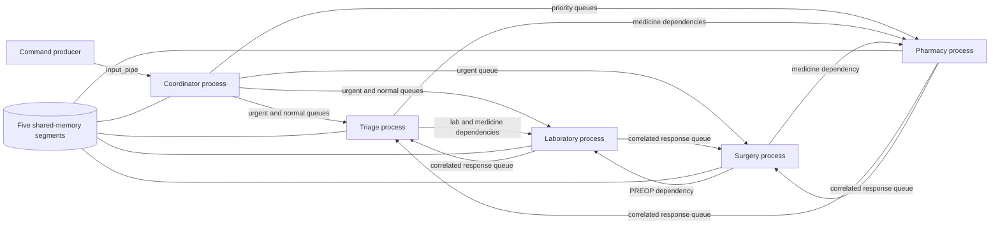

# Architecture

## System overview

The simulator is one Linux executable that starts a coordinator and forks four
specialized child processes. It deliberately uses operating-system primitives
instead of hiding concurrency behind a framework.

The coordinator owns startup and shutdown. It validates configuration, creates
IPC resources, parses incoming lines into typed commands, dispatches commands
at their simulated `init` time, handles reporting signals, reaps children, and
removes only resources owned by this application.

## Process and thread model

| Process | Long-lived threads | Short-lived work |
|---|---|---|
| Coordinator | simulation clock | one detached, lifecycle-counted dispatcher per accepted timed command |
| Triage | emergency manager, appointment manager, response monitor, stability monitor, configured doctor workers | treatment occurs in doctor workers |
| Surgery | request manager and response monitor | one joinable operation thread per admitted surgery |
| Pharmacy | urgent/high worker, normal worker, stock monitor, statistics worker | request handling occurs in the priority workers |
| Laboratory | urgent manager and normal manager | one detached execution task per admitted request |

Surgery uses a central priority scheduler plus operation threads rather than
three permanently running room-manager threads. This keeps room ownership,
medical-team limits, urgency, and scheduled time in one ordering decision while
retaining a dedicated semaphore for every room.

## IPC map

| Primitive | Count | Role |
|---|---:|---|
| System V message queues | 3 | urgent work, normal work, and destination-specific correlated responses |
| System V shared memory | 5 | global statistics, operating rooms, pharmacy stock, laboratory state, and critical-event ring buffer |
| Named POSIX semaphores | 7 | three rooms, medical teams, two laboratory equipment pools, and pharmacy access |
| Named pipes | 5 | public input plus one assignment-compatible endpoint for each component |
| Process-shared mutexes | several | consistent statistics and shared resource state |

The public input FIFO is the command entry point. Component FIFOs are created to
preserve the assignment's required topology; internal typed routing uses message
queues so commands retain all validated fields.

## Request lifecycle

1. A newline-terminated command arrives through `input_pipe`.
2. The coordinator validates its complete structure and values.
3. A dispatcher waits until the command's simulated `init` time.
4. The typed command is sent to the appropriate priority queue.
5. The component reserves its capacity and performs the work.
6. Triage and surgery create correlated laboratory/pharmacy dependencies and
   wait for responses addressed specifically to their process.
7. The operation updates shared statistics and emits one append-only log record.
8. Laboratory and pharmacy requests also create detailed result files.

## Synchronization and ownership

- The coordinator is the sole creator and final remover of project IPC.
- An exclusive instance lock prevents two coordinators from sharing the same
  fixed IPC names and keys.
- Shared-memory mutexes use `PTHREAD_PROCESS_SHARED`.
- Medicine reservation validates an entire request before changing stock.
- Room and medical-team semaphores are always released by the operation that
  acquired them.
- Shutdown flags shared by signal handlers and threads use C11 atomic values.
- Log records use one append-only write, preventing partial records from
  different processes from being interleaved.

## Shutdown sequence

`SIGINT` or `SIGTERM` requests a bounded graceful shutdown. The coordinator
stops admitting input, joins its dispatchers and clock, signals the four child
processes, waits for them, writes a final statistics snapshot, and removes its
queues, shared memory, semaphores, FIFOs, and lock.

The current policy is best described as *stop and cancel dependencies that can
no longer complete*, not as a guaranteed drain of every accepted request. This
limitation remains visible as `SYS-06` in the requirements traceability table.

## Verification boundaries

The suite tests behavior through the same FIFO, signals, processes, and output
files used by a real run. Sanitizers and Valgrind cover a representative
multi-component workload. The narrow suppressions in `tests/valgrind.supp`
document tool limitations around glibc's TLS cache and DRD's model of named
semaphores reopened after `fork()`; application call stacks remain unsuppressed.
